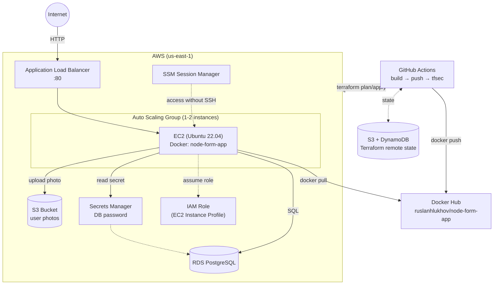

# node-form-app

A learning DevOps project: a simple registration web app (Node.js + PostgreSQL + S3 for photo uploads), deployed to AWS via modular Terraform, with automated CI/CD in GitHub Actions.

The point of the project isn't the registration form itself — it's the infrastructure around it: auto scaling, managed secrets, secure instance access, remote Terraform state, and automated security scanning.

## Architecture



## Tech stack

| Category | Technologies |
|---|---|
| Application | Node.js, Express, PostgreSQL (pg), Multer, bcrypt |
| Containerization | Docker, Docker Hub |
| Infrastructure | Terraform (modular structure), AWS |
| Compute | EC2, Auto Scaling Group, Launch Template, Application Load Balancer |
| Data | RDS PostgreSQL, S3 (user photos) |
| Security | AWS Secrets Manager, IAM Roles, SSM Session Manager |
| CI/CD | GitHub Actions, tfsec |
| State management | Terraform remote backend (S3 + DynamoDB lock) |

## Repository structure

```
.
├── main.tf                  # root file, wires up the modules
├── variables.tf
├── modules/
│   ├── security/             # Security Groups (ALB, App, DB)
│   ├── storage/               # S3 bucket for photos
│   ├── iam/                    # IAM role, policies, instance profile, SSM
│   ├── database/               # RDS + managed master password
│   ├── alb/                     # Application Load Balancer + Target Group
│   └── compute/                 # Launch Template, ASG, user_data.sh.tpl
├── server.js                 # Express application
├── Dockerfile
├── docker-compose.yml         # for local development
├── public/                     # static frontend (index.html)
└── .github/workflows/ci.yaml   # CI/CD pipeline
```

## How it works

1. The user opens the registration form through the load balancer's public DNS name.
2. The ALB routes traffic to one of the instances in the Auto Scaling Group (health check on `/health`).
3. On boot, each instance's `user_data` script:
   - installs Docker and the SSM Agent;
   - fetches the database password from **AWS Secrets Manager** (the password is generated automatically by RDS and never stored in code or entered manually);
   - starts the application container with the required environment variables.
4. The application hashes user passwords with **bcrypt** before writing them to PostgreSQL.
5. Uploaded photos are stored in a private **S3 bucket** via the instance's IAM Role (no static access keys involved).
6. Access to instances for troubleshooting is done exclusively through **AWS SSM Session Manager** — there is no open SSH port to the internet.
7. Terraform state (`terraform.tfstate`) is stored remotely in **S3 with DynamoDB locking**, allowing the infrastructure to be managed safely from multiple machines.
8. On every push to `main`, **GitHub Actions**:
   - builds and pushes the Docker image to Docker Hub;
   - in parallel, scans the Terraform code for security issues with **tfsec**.

## Deployment

### Prerequisites

- Terraform >= 1.5
- AWS CLI configured via `aws configure`
- Docker (for local development)
- An existing S3 bucket and DynamoDB table for remote state (see the `backend "s3"` block in `main.tf`)

### Provisioning the infrastructure

```bash
git clone https://github.com/RuslanHlukhov/node-form-app.git
cd node-form-app

terraform init
terraform plan
terraform apply
```

Once applied, the application URL is available as an output:

```bash
terraform output app_url
```

### Local development

```bash
echo "DB_PASSWORD=secret" > .env
docker compose up --build
```

The app will be available at `http://localhost:3000`, with a health check at `http://localhost:3000/health`.

### Tearing down the infrastructure

This is a learning project, so once testing is done the infrastructure is fully destroyed to avoid paying for idle resources (the ALB, RDS, and NAT gateways are the most expensive components while idle):

```bash
terraform destroy
```

The Terraform state itself stays in S3 and is reused on the next `apply`.

## Security: what's already in place

- The database password is generated and stored in AWS Secrets Manager — never passed around or stored in code.
- User passwords are hashed with bcrypt before being saved to the database.
- EC2 access is handled through SSM Session Manager; there is no SSH ingress rule in the security group.
- The instance's access to S3 and Secrets Manager is scoped through an IAM Role with least-privilege permissions (`PutObject`/`GetObject`/`ListBucket` limited to one specific bucket, `GetSecretValue` limited to one specific secret) — no static access keys.
- Terraform state is stored remotely in S3 with versioning and encryption enabled, with DynamoDB used for state locking.
- The Terraform code is scanned for security issues with tfsec on every push, as part of CI.

## Roadmap

- [ ] Private subnets for EC2 and RDS (currently using the default VPC)
- [ ] HTTPS via ACM + a custom domain
- [ ] Automated `terraform plan`/`apply` in CI/CD via OIDC (no AWS keys stored in GitHub Secrets)
- [ ] CloudWatch alarms on ASG CPU and ALB 5xx responses
- [ ] Multi-environment setup (dev/prod) via separate `.tfvars` files

## Author

Ruslan Hlukhov — [github.com/RuslanHlukhov](https://github.com/RuslanHlukhov)
